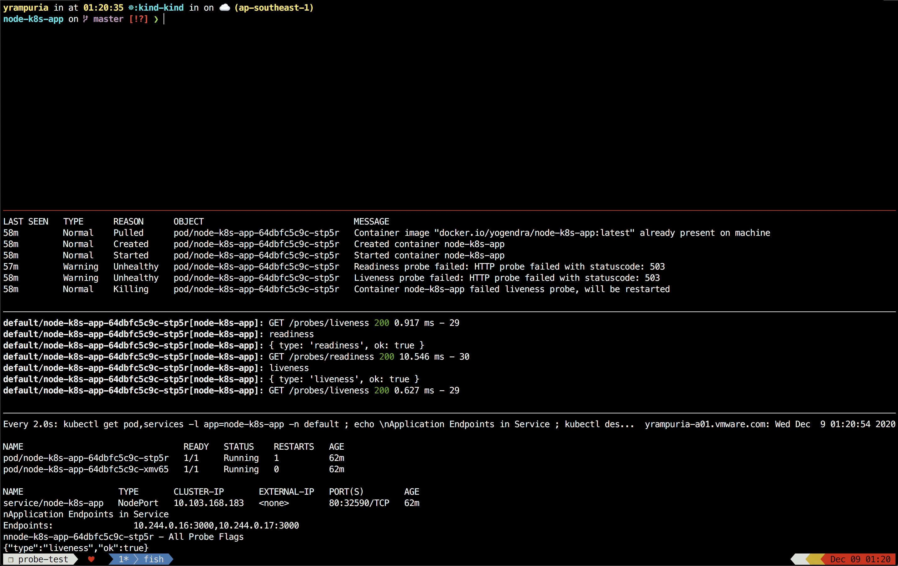

# NodeJS Sample App

This is a sample app showing use of liveness and readness probe for kubernetes.

Goals:
1. Define http based probes
2. Implement a basic check
3. Keep probes private


# How to build, test and deploy?

1.  Build docker image
    ```
    export IMAGE_NAME=docker.io/yogendra/node-k8s-app:latest
    docker build -t $IMAGE_NAME app
    ```
2.  Test locally 
    
    a.  In Docker
        
        ```
        docker run --rm -it -p 3000:3000 -p 3001:3001 $IMAGE_NAME
        ```

    b.  In KiND
        
        ```
        kind load docker-image $IMAGE_NAME
        ```
3.  Push image to registry for pulling into the Kubernetes cluster.

    ```
    docker push $IMAGE_NAME
    ```

4.  Deploy on kubernetes cluster
    
    *NOTE: Replace `image:` in `k8s/deployment.yaml` with the correct image name*

    ```
    kubectl apply -f k8s/deployment.yaml
    ```
    

# Kubernetes Cluster Testing

1.  Create kind cluster
    ```
    kind create cluster
    ```

2.  Deploy application
    ```
    kubectl apply -f k8s/deployment.yaml
    ```

# Demostract Probe Behavior

1.  Launch `demo` shell. This uses tmux. If you don't know tmux, follow steps below:

    ```
    ./demo
    ```

    **OR** 
    
    Start 3 more ternibal tabs/panes (total 4) in your terminal emulator and run following comands manually:

    1.  Monitor Events

        ```
        ./demo watch-events
        ```
    1.  Tail Logs

        ```
        ./demo tail-logs
        ```
    
    1.  Monitor pods, service, endpoint and pods probe flags

        ```
        ./demo monitor-assets
        ```

1. This will launch a tmux session with split panes
    
    

    You can use `Ctrl+b d` to exit this at the end.
    
1.  In this first you will run commands to cause a breakage and fix in the probes.
    And other panes will show status, logs, events, etc. 

1.  Lets break liveness probe first

    ```
    ./demo break liveness
    ```
1.  Read through logs, events and probe flags. 

1.  Container should restart immediately on probe failure. 

1.  Lets break liveness probe

    ```
    ./demo break readiness
    ```

1.  Read through logs, events and probe flags. 

1.  Container is not restarted. Buy, endpoint is removed from the service

1.  Lets fix readiness probe

    ```
    ./demo fix readiness
    ```

1.  Container is marked as ready. Endpoint is added to service


    


